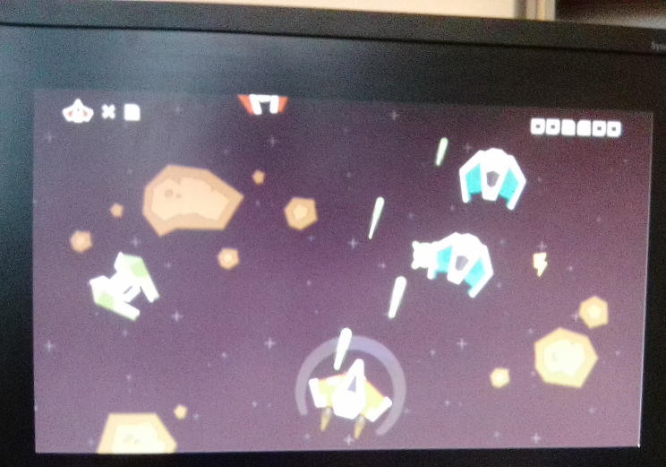

# VGASRAMVerilog

Based on [@WillGreen](https://github.com/WillGreen/) tutorial. File are given for the Nexys-4 DDR.

```bash
sudo pip install pillow
git clone https://github.com/WillGreen/fpgatools
cd fpgatools/img2fmem
mv test/game.png .
python img2fmem.py game.png 6 mem
```

Then, create a Vivado project for the Nexys-4 DDR and generate the bitstream :smile: (the BTNC button needs to be pushed)



## References

- https://github.com/WillGreen/timetoexplore (contains some basics on the VGA format, see the Readme file)
